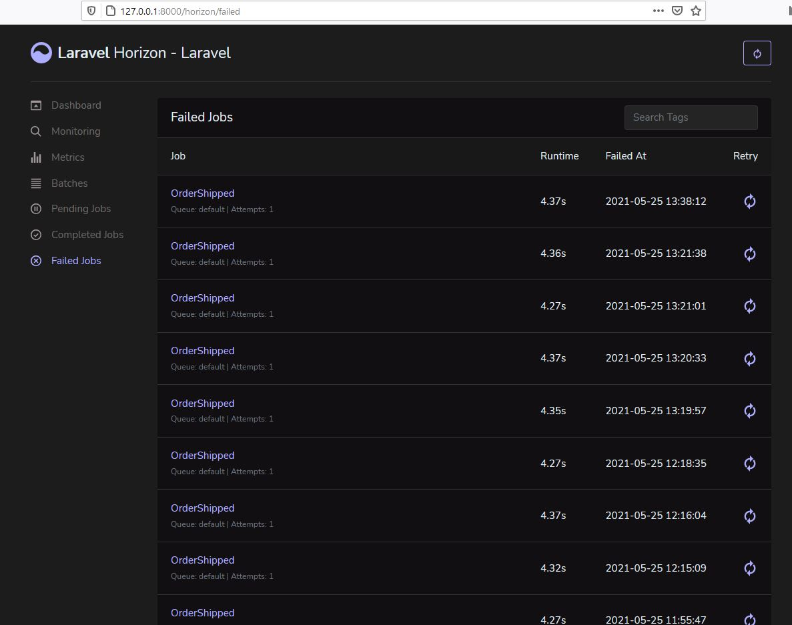

#### Deploy Laravel project from GitHub

<strong><i>Prerequisites:</i></strong> It assumes you have PHP, MySQL, Composer, Node.js, 
Npm, Redis  installed on your system. 

1. Clone the repo and cd into it

2.  composer install --ignore-platform-reqs

3. mysql -u root -p 
create database <strong>db_name;</strong> 
exit

4. Edit  <strong>env.</strong> file

5. php artisan migrate

6. npm install  && npm run dev

7. Update your Laravel application .env file like this -
   
   QUEUE_CONNECTION=redis
#### Run

1. php artisan serve or use Laravel Valet or Laravel Homestead

2.  Visit localhost:8000 in your browser

3. Install Redis :

Go to https://github.com/microsoftarchive/redis/releases to Download .msi file.

By Default Redis Server runs on the port 6379.
Let’s Open the redis-cli and interact with the server.
C:\Program Files\Redis\redis-cli.exe
Double click the redis-cli.exe to start the client interface.
Test Redis
127.0.0.1:6379> ping
PONG
127.0.0.1:6379>
test redis: redis-cli ping. and you will recieve PONG in response

4. php artisan queue:work

5. php artisan serve or use Laravel Valet or Laravel Homestead

6. register

7. run job: button "Send Email" 

8. visit: http://127.0.0.1:8000/horizon/dashboard

